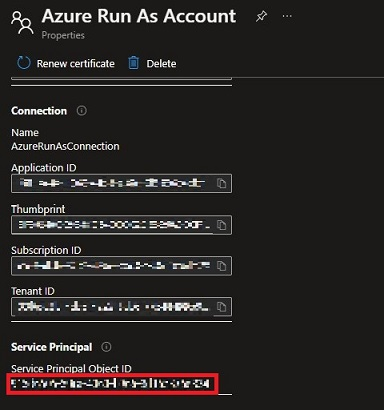
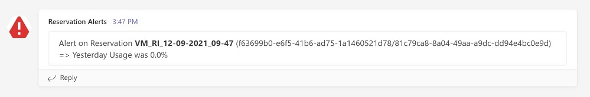

# reservation-alerts
## Purpose
Azure Automation runbook for reservation alerts.

This runbook will raise an alert to a dedicated Teams channel if a reservation usage is below a specified threshold.

All reservations in current directory will be checked. 

## Prerequisites
### Configure Teams Channel
Reservation alerts will be sent to a Teams channel using Teams APIs.

You need to enable this feature on Channel using Incoming Webook connector see [Teams connectors documentation](https(https://docs.microsoft.com/en-us/microsoteams/platform/webhooks-and-connectors/how-to/)add-incoming-webhook#create-an-incoming-webhook-1)

Copy generated URL to provide it as a parameter to Azure Automation runbook (will be referenced as `TeamsChannelUrl`)  

### Create and configure Azure Automation Account
Use your favorite method to create a new Azure Automation Account:
- [Azure Portal](https://docs.microsoft.com/en-us/azure/automation/automation-create-standalone-account?tabs=azureportal#create-a-new-automation-account-in-the-azure-portal) 
- [Azure CLI](https://docs.microsoft.com/fr-fr/cli/azure/automation/account?view=azure-cli-latest#az-automation-account-create)
- [Powershell](https://docs.microsoft.com/en-us/powershell/module/az.automation/new-azautomationaccount?view=azps-7.2.0)
- [Terraform](https://registry.terraform.io/providers/hashicorp/azurerm/latest/docs/resources/automation_account) 

Sample with Powershell:
```console
New-AzAutomationAccount -Name 'myAutomationAccount' -Location 'North Europe' -ResourceGroupName 'RG-CDU'
```

### Create "Run as Account"
Run As accounts in Azure Automation provides authentication for managing resources on the Azure Resource Manager using Automation runbooks.

Follow [Azure Automation Account documentation](https(https://docs.microsoft.com/en-us/azure/automatiocreate-run-as-account#create-account-in-azu)re-portal) to create an Automation Account using Azure Portal (easiest way) 


### Set "Run as Account" permissions
- **Set global permission**

By default, Run as Account Service Principal will get `Contributor` permission but we only need `Reader` permission.

These Powershell commands will remove `Contributor` and set `Reader` permissions on Azure Automation Service Principal (aka Run As Account):
```console
Remove-AzRoleAssignment -PrincipalId "xxxxxxxx-xxxx-xxxx-xxxx-xxxxxxxx" -RoleDefinitionName "Contributor"

New-AzRoleAssignment -PrincipalId "xxxxxxxx-xxxx-xxxx-xxxx-xxxxxxxx" -RoleDefinitionName "Reader"
```

*You can easily find Service Principal ID in Run as Account blade on Azure Portal*



 - **Set reservations permission**

To list all reservations, we use `Reservations Reader` permission, it gives read-only access to reservations in current Azure Active Directory tenant (directory) see [View/Manage Reservations documentation](https://docs.microsoft.com/en-us/azure/cost-management-billing/reservations/view-reservations#assign-a-reservation-reader-role-at-the-tenant-level)  

To set this permission, you must  be authentucated as a **Global Admin with elevated privilieges** See [Azure AD documentation](https://docs.microsoft.com/en-us/azure/role-based-access-control/elevate-access-global-admin)

This Powershell command will set `Reservations Reader` permission on Azure Automation Service Principal (aka Run As Account):
```console
New-AzRoleAssignment -Scope "/providers/Microsoft.Capacity" -PrincipalId "xxxxxxxx-xxxx-xxxx-xxxx-xxxxxxxx" -RoleDefinitionName "Reservations Reader"
```

### Configure Automation Account 
Define 2 variables
 - `TeamsChannelUrl` = URL to get access to Teams Incoming Webook connector (created earlier)
```console 
New-AzAutomationVariable -AutomationAccountName "myAutomationAccount" -Name "TeamsChannelUrl" -Encrypted $False -Value "http://your-url" -ResourceGroupName "RG-CDU"
```
 - `UsageThreshold` = Reservation Usage Percentage above which alerts will be sent 
```console
New-AzAutomationVariable -AutomationAccountName "myAutomationAccount" -Name "UsageThreshold" -Encrypted $False -Value 80 -ResourceGroupName "RG-CDU"
```

## Deploy
### Create Powershell runbook
Download Powershell script:
```console
wget https://raw.githubusercontent.com/cdupui/reservation-alerts/main/reservation-alerts.ps1   
```

Go to the directory where you downloaded `reservation-alerts.ps1` and execute Powershell command to create and deploy Azure Automation Powershell runbook: 
```console
$importParams = @{
    Name = "ReservationAlerts"
    Path = "reservation-alerts.ps1"
    ResourceGroupName = "RG-CDU"
    AutomationAccountName = "myAutomationAccount"
    Type = "PowerShell"
}
Import-AzAutomationRunbook @importParams
```
### Test Powershell runbook
In Azure Portal, Go to the runbook Editor see [Edit runbook documentation](https://docs.microsoft.com/en-us/azure/automation/automation-edit-textual-runbook#edit-a-runbook-with-the-azure-portal)  

Then use Test Pane to execute runbook and check results see [Test runbook documentation](https://docs.microsoft.com/en-us/azure/automation/manage-runbooks#test-a-runbook) 

If a reservation usage is below specified threshold you should see an alert message in Teams channel



## Finalize runbook execution
### Publish runbook
If all tests are fine, you have to publish your runbook to finalize deployment see [Publish runbook documentation](https://docs.microsoft.com/en-us/azure/automation/manage-runbooks#publish-a-runbook)  

### Schedule execution
Last optional (but recommended) step is to schedule this runbook to get daily alerts if your reservations are not used as expected see [Schedule runbook documentation](https://docs.microsoft.com/en-us/azure/automation/manage-runbooks#schedule-a-runbook-in-the-azure-portal) 

## Releases
### v0.2
Handle API pagination (when reservation count > 50)
### v0.1
Initial release
